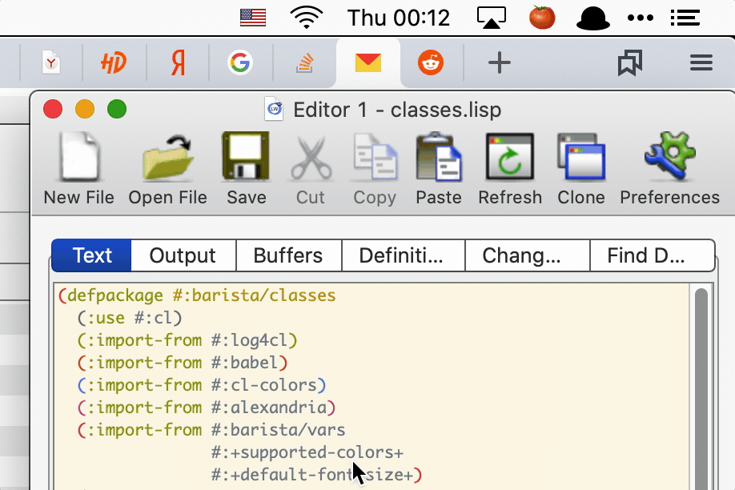

=========
 Barista
=========

This programm allows you to put any information you need into the OSX's menu bar.

There is similar software - the `BitBar`_ and `TextBar`_. The difference between the BitBar and Barista:

* BitBar periodically starts each plugin as a subprocess, Barista runs them as threads in the main process.
* With BitBar, you need a place to keep state between the process invocations.
* With Barista, you just have all state in memory and don't need to bother.
* You can write plugins for BitBar in any language, but most plugins are written in BASH.
* BitBar's API forces you to use ``text`` to describe menu items.
* You are using powerful Common Lisp language, to implement plugins for Barista.
* Because of Lisp, you can debug your plugins, connecting the IDE to Barista process.

TextBar is similar to the BitBar, but seems more featureful because it allows to render a dropdown
as HTML and to display simple graphs in the menu bar. Probably, some of these features will be added
to the Barista too.

Installation
============

Right now there is no a binary to install, you need a `LispWorks`_ to load and run program.

Roadmap
=======

* Implement few useful plugins.
* Add a documentation.
* Create a distribution installable by Homebrew.
* Publish app to App Store.

.. _BitBar: https://getbitbar.com/
.. _TextBar: http://richsomerfield.com/apps/textbar/
.. _LispWorks: http://www.lispworks.com/
