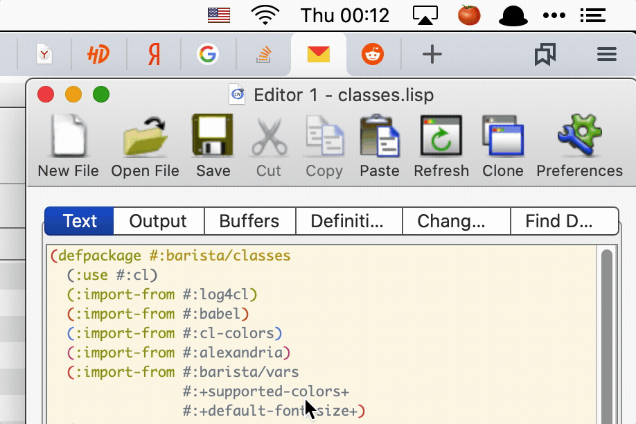

=========
 Barista
=========

This programm allows you to put any information you need into the OSX's menu bar.

There is similar software - the `XBar`_ and `TextBar`_. The difference between the XBar and Barista:

* XBar periodically starts each plugin as a subprocess, Barista runs them as threads in the main process.
* With XBar, you need a place to keep state between the process invocations.
* With Barista, you just have all state in memory and don't need to bother.
* You can write plugins for XBar in any language, but most plugins are written in BASH.
* XBar's API forces you to use ``text`` to describe menu items.
* You are using powerful Common Lisp language, to implement plugins for Barista.
* Because of Lisp, you can debug your plugins, connecting the IDE to Barista process.

TextBar is similar to the XBar, but seems more featureful because it allows to render a dropdown
as HTML and to display simple graphs in the menu bar. Probably, some of these features will be added
to the Barista too.

Installation
============

Download the latest ``Barista-x.y.z.dmg`` from the `GitHub Releases`_ page,
open it and drag ``Barista.app`` to your ``Applications`` folder.

Because the app is not signed with an Apple Developer certificate, macOS will
attach a quarantine flag to it when downloaded from the internet and refuse to
open it with a *"Barista is damaged and can't be opened"* message.

To remove the quarantine flag, run the following command in Terminal after
copying the app to ``/Applications``:

.. code:: bash

   xattr -dr com.apple.quarantine /Applications/Barista.app

Then open the app normally.

.. _GitHub Releases: https://github.com/40ants/barista/releases

Writing Plugins
===============

Plugins live as ``.lisp`` files in ``~/.config/barista/plugins/``.  Each file
is loaded at startup.  Use the ``defplugin`` macro to define one.

Text icon
---------

The simplest plugin shows a plain text (or emoji) label in the menu bar and
updates it on a schedule:

.. code:: common-lisp

   (defpackage #:my-plugins/clock
     (:use #:cl)
     (:import-from #:barista/plugin #:defplugin #:get-title)
     (:import-from #:barista/vars   #:*plugin*))
   (in-package #:my-plugins/clock)

   (defplugin clock ()
     (:title "🕐")
     (:every :minute
       (setf (get-title *plugin*)
             (local-time:format-timestring nil (local-time:now)
                                           :format '(:hour ":" (:min 2))))))

``defplugin`` options:

* ``(:title EXPR)`` — initial menu-bar label; may be a plain string, an emoji,
  or an ``NSAttributedString`` built with ``make-attributed-string`` /
  ``join-attributed-string``.
* ``(:every PERIOD FORMS…)`` — background worker thread.  ``PERIOD`` is a
  keyword (``:second``, ``:minute``, ``:hour``) or a list like
  ``(15 :seconds)``.
* ``(:menu SYMBOL)`` — name of a ``defmenu`` form to display on click.

Image icon
----------

Pass an ``(:image PATH)`` option instead of ``(:title …)`` to display a PNG or
ICNS file as the status-bar icon.

.. code:: common-lisp

   (defpackage #:my-plugins/status
     (:use #:cl)
     (:import-from #:barista/plugin  #:defplugin #:get-image)
     (:import-from #:barista/classes #:make-ns-image)
     (:import-from #:barista/vars    #:*plugin*))
   (in-package #:my-plugins/status)

   ;; Colour icon — template NIL so pixels render as-is (default).
   (defplugin status-colour ()
     (:image #p"~/.config/barista/icons/my-icon.png" :size 18))

   ;; Monochrome/symbolic icon — template T so macOS adapts it to
   ;; dark/light mode automatically.
   (defplugin status-mono ()
     (:image #p"~/.config/barista/icons/mono-icon.png" :size 18 :template t))

``(:image PATH)`` options:

* ``PATH`` — a CL pathname or namestring, evaluated at plugin start time.
* ``:size N`` — scale the image to N×N points (default 18).
* ``:template T`` — mark as a *template image* so macOS recolours it to match
  the current appearance (dark/light mode).  Use ``T`` for monochrome symbolic
  icons, leave ``nil`` (default) for colour images.

You can also update the icon at runtime from a worker thread using
``(setf (get-image *plugin*) path-or-ns-image)``; it accepts a pathname, a
namestring, or an ``NSImage`` pointer created with ``make-ns-image``:

.. code:: common-lisp

   (:every (30 :seconds)
     (let ((icon-path (render-current-state-to-png)))
       (setf (get-image *plugin*) icon-path)))

Enabling plugins
----------------

On first launch Barista shows a system icon in the menu bar.  Click it and
choose **Plugins** to enable the plugins you want.  The selection is saved to
``~/.config/barista/settings.lisp`` and restored on every subsequent launch.

Roadmap
=======

* Implement few useful plugins.
* Add a documentation.
* Create a distribution installable by Homebrew.
* Publish app to App Store.

.. _XBar: https://github.com/matryer/xbar
.. _TextBar: http://richsomerfield.com/apps/textbar/
.. _LispWorks: http://www.lispworks.com/
